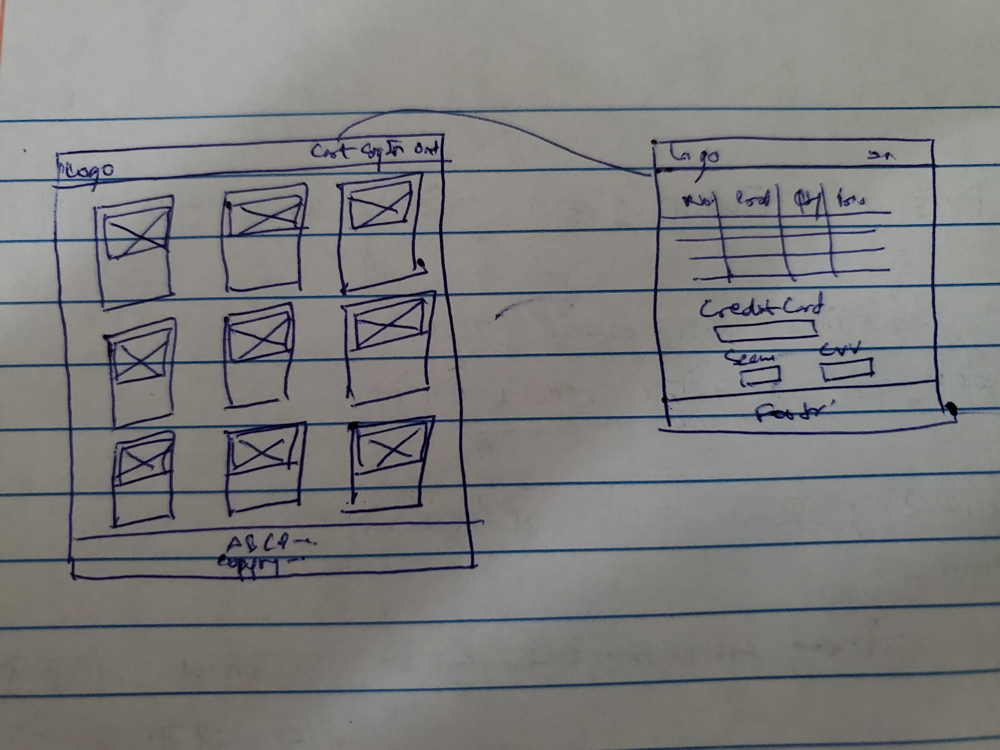

# Apparels

This is an e-commerce application where customer can see and buy items put on sale on the application by the owner. The application is basically a single page but with multiple views. The backend server for the application is deployed and hosted on heroku while the main application itself is hosted on github.

## Links
**Deployed Application :** <https://maharit108.github.io/apparel-client/>

**Deployed API :** <https://whispering-hollows-83607.herokuapp.com/> + </URI_from_documenation>

**API documentation :** <https://github.com/maharit108/apparel-api>

## Technologies Used
- HTML/CSS
- React
- Axios

## Planning Story
As the previous projects, this project too is divided into front and back end parts. This repo is the front end section of the complete application. All of the front end is built using React with JS using Axios calls to interact with the backend server.

Front end has 3 primary views, authentication, owner/admin view and user/customer view. A user can sign up, sign in, change password and sign out. User can be a customer or a owner/admin. Admin account cannot be created from front end and is provided to owner. A owner once signed in can add, edit and remove items on sale along with all other functions of a customer. A customer can see and add items to cart which can be bought once signed in. CRUD operations can be performed on items put for sale by owner.

By toggling views in the application, various interface is presented to user depending on the action by the user. On start, user is presented with a view displaying all items on sale.

In the application, React is used for building components which add up to become structure of application with CSS for styling. Axios calls are used to interact with server making use of promises to handle responses from server. JS is used for basic logical processes in the application.

## User Stories
- As a user, I would like to see all the items put on sale by owner.
- As a user, I would like to add or remove items from my cart.
- As a user, I would like to buy items from my cart.
- As a owner, I would like to add my items for sale.
- As a owner, I would like to edit and remove my items put up for sale.

___
## Future Upgrades
- Use AWS- S3 to store image of items instead of using weblinks.
- Use stripe to check for credit card validation
- Use recaptcha to verify that user is not a AI.

___
## Wireframe
- Initial Wireframe

- Final Wireframe

